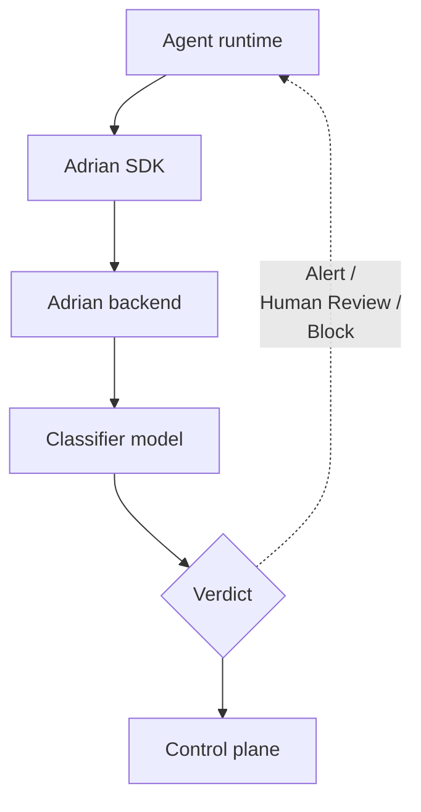

<p align="center">
  <picture>
    <source media="(prefers-color-scheme: dark)" srcset="assets/adrian-logo-dark.png">
    
  </picture>
</p>

<p align="center">
  <b>Open-source runtime security monitoring and control for AI agents.</b>
</p>

<p align="center">
  <a href="LICENSE"></a>
  <a href="https://app.adrian.secureagentics.ai/"></a>
  <a href="https://pypi.org/project/adrian-sdk/"></a>
  <a href="https://discord.gg/Vq2VyYrw8Z"></a>
  <a href="https://www.linkedin.com/company/secure-agentics"></a>
  <a href="https://www.producthunt.com/products/adrian?embed=true&amp;utm_source=badge-featured&amp;utm_medium=badge&amp;utm_campaign=badge-adrian" target="_blank" rel="noopener noreferrer"></a>
</p>

---

Adrian is an open-source, [AARM-aligned](https://aarm.dev) runtime security monitoring and control engine for AI agents. It analyses both agent activity logs (tool calls, actions, outputs) and reasoning traces to detect malicious, misaligned, or out-of-remit behaviour, and optionally intervene in-flight. Python SDK with a two-line install to LangChain agents.

<p align="center">
  <a href="https://docs.adrian.secureagentics.ai">Documentation</a>
  &nbsp;•&nbsp;
  <a href="https://app.adrian.secureagentics.ai">Dashboard</a>
  &nbsp;•&nbsp;
  <a href="https://discord.gg/Vq2VyYrw8Z">Discord</a>
  &nbsp;•&nbsp;
  <a href="https://www.linkedin.com/company/secure-agentics">LinkedIn</a>
</p>

https://github.com/user-attachments/assets/ba50e6e4-fe3e-47b2-aa69-2902e1ef2924

##### New to Adrian? Check out the [Launch Video](https://www.youtube.com/watch?v=NkEISlRhyFs)
## Quickstart

> **Want the stupidly simple, 60-second hands-off install?** Feed your coding agent (Claude, Codex, Cursor, etc.) this file: [GET_STARTED_AI_GUIDE.md](https://github.com/secureagentics/Adrian/blob/main/GET_STARTED_AI_GUIDE.md). It will walk you through the installation process - [video guide here](https://youtu.be/7vYjeGxY8to). Always review instructions manually

The next fastest way to try Adrian is the managed dashboard at [app.adrian.secureagentics.ai](https://app.adrian.secureagentics.ai). Sign-up takes a minute and there is nothing to install beyond the SDK. To run Adrian on your own infrastructure instead, jump to [Self-hosting](#self-hosting) below.

1. Sign up at [app.adrian.secureagentics.ai](https://app.adrian.secureagentics.ai) and generate an API key.

2. Configure Adrian for your agent and your preferences (remit of your agent, audit vs block mode, alerting channels, accepted behaviours vs known-risks).

3. Install the SDK:

   ```sh
   pip install adrian-sdk
   ```

4. Install the LangChain provider for your agent's model (the SDK auto-instruments LangChain / LangGraph; pick whichever provider matches your model):

   ```sh
   pip install langgraph langchain-openai   # or langchain-anthropic, etc.
   ```

   <sup>Last verified with `langchain-core==1.3.3`, `langgraph==1.1.2`, `langchain-openai==1.2.1` (2026-05-08).</sup>

5. Wrap your LangChain agent. Two lines of Adrian (`init` + `shutdown`) bracket your normal LangChain / LangGraph code:

   ```python
   import asyncio
   import adrian
   from langchain_openai import ChatOpenAI

   async def main():
       adrian.init(api_key="adr_live_...")
       llm = ChatOpenAI(model="gpt-4o")
       response = await llm.ainvoke(
           "Find the most underpriced recent IPOs and build an investment strategy",
       )
       print(response.content)
       adrian.shutdown()

   asyncio.run(main())
   ```

   Full runnable version (with env-var checks) at [`examples/quickstart.py`](examples/quickstart.py).

6. Run your agent. Events appear in the dashboard within seconds, classified by severity.

Full guide: [Quickstart](https://docs.adrian.secureagentics.ai/quickstart).

## Self-hosting

Adrian supports entirely offline, data sovereign deployments using just a handful of docker commands. This repository ships everything needed to run the entire Adrian stack on a single host: the Go backend (WebSocket + dashboard API + AI engine), the Next.js dashboard, the Python SDK, and a Llama.cpp container that serves a local Gemma model. No managed cloud, no telemetry leaving the box.

> **Hardware support:** Tested on NVIDIA GPUs with Gemma 4 (E2B / E4B) which is the model the bootstrap picker downloads by default. CPU-only is technically possible but will be slow on real workloads with those sized models.

### Prerequisites

- A host with Docker + Docker Compose v2.
- An **NVIDIA GPU** with recent CUDA driver and the [NVIDIA Container Toolkit](https://docs.nvidia.com/datacenter/cloud-native/container-toolkit/latest/install-guide.html) installed (for the bundled Llama.cpp classifier). ~10 GB free disk for the model.

### Bring-up

1. **Clone:**

   ```
   git clone https://github.com/secureagentics/Adrian
   cd Adrian
   ```

2. **Run bootstrap.** Creates `data/adrian.db`, applies migrations, generates a random admin password, and writes `.env`. With no `--gguf` flag, the bootstrap interactively offers to download the recommended on-device classifier (Gemma 4 E4B, ~5 GB, or E2B ~3 GB) into `./models/`.

   ```sh
   # Default: interactive picker downloads Gemma 4 E4B / E2B
   docker compose --profile setup run --rm setup bootstrap

   # Already have a GGUF under ./models/? Pass it by name
   docker compose --profile setup run --rm setup bootstrap \
       --gguf my-model.gguf
   ```

3. **Start the stack.**

   ```sh
   docker compose --profile llm up -d
   ```

4. **Open the dashboard.** Browse to `http://localhost:3000`. Sign in with `admin@localhost` plus the password the bootstrap printed; you'll be prompted to set a new one. Create an SDK API key and configure Adrian to monitor your specific agent from **Settings → Agents → New key**.

5. **Wrap your agent.** The SDK lives in-tree under `sdk/`. Install it into a fresh `.venv` via the bundled Make target (uses [uv](https://docs.astral.sh/uv/)):

   ```sh
   make sdk-install
   source .venv/bin/activate
   ```

   Install the LangChain provider for your agent's model into the same venv:

   ```sh
   uv pip install langgraph langchain-openai   # or your chosen langchain provider
   ```

   <sup>Last verified with `langchain-core==1.3.3`, `langgraph==1.1.2`, `langchain-openai==1.2.1` (2026-05-08).</sup>

   Use the same `adrian.init` snippet as in the [Quickstart](#quickstart) above. The SDK defaults to `ws://localhost:8080/ws`, so a self-hosted setup needs nothing more than the API key - drop the `ws_url=` line.

To [reset the admin password](https://docs.adrian.secureagentics.ai/reference/backend#reset-the-admin-password), [change the model](https://docs.adrian.secureagentics.ai/reference/backend#switch-the-local-gguf) and much more check out the dedicated [Docs site](https://docs.adrian.secureagentics.ai/).

## Why Adrian is different

Most agent monitoring stops at activity logs: APIs, MCP, DB interactions, tool calls, etc. Adrian enhances this by also analysing the agent's reasoning: understanding _why_ it took an action, under what context, and what it is planning on doing next. [Research by OpenAI and DeepMind](https://arxiv.org/pdf/2503.11926) found that combining behaviour and reasoning analysis like this boosts detection accuracy by around 35% and is 4x more likely to catch nuanced attacks. Adrian is the first tool to put that into a deployable security control, and it is free, forever.

Furthermore, most tools in this space are lightweight machine learning classifiers trained to spot patterns which match their training data (usually labelled prompt injection datasets). Adrian takes a different approach: it uses world models that understand risk through reasoning like a human does. It correlates behaviours across a session, holds a working understanding of what the agent is meant to be doing, and assesses each new action against that. The detection logic is closer to a human reviewer's than to pattern matching against examples it has been trained to spot. For example, if your e-commerce agent starts resetting user passwords that isn't going to appear in any training dataset, but this is a risk you should be flagging. This is where you get the meaningful security uplift that allows you to use agentic AI with confidence, and it's exactly why we made Adrian.


## Architecture



## Integrations

<table>
  <thead>
    <tr><th></th><th>At launch</th><th>On roadmap</th></tr>
  </thead>
  <tbody>
    <tr>
      <th align="left">Frameworks</th>
      <td>
        <a href="https://www.langchain.com/"></a>
      </td>
      <td>
        <a href="https://platform.openai.com/docs/agents"><picture><source media="(prefers-color-scheme: dark)" srcset="assets/logos/openai-dark.svg"></picture></a>&nbsp;&nbsp;
        <a href="https://docs.anthropic.com/"></a>&nbsp;&nbsp;
        <a href="https://www.crewai.com/"></a>&nbsp;&nbsp;
        <a href="https://github.com/openclaw/openclaw"></a>
      </td>
    </tr>
    <tr>
      <th align="left">Alerting</th>
      <td>
        <a href="https://discord.com/"></a>&nbsp;&nbsp;
        <a href="https://slack.com/"></a>
      </td>
      <td>
        <a href="https://www.whatsapp.com/"></a>&nbsp;&nbsp;
        <a href="https://www.microsoft.com/microsoft-teams/group-chat-software"></a>&nbsp;&nbsp;
        <a href="https://www.pagerduty.com/"></a>
      </td>
    </tr>
  </tbody>
</table>

Full list: [Integrations](https://docs.adrian.secureagentics.ai/integrations).

## Contributing

See [CONTRIBUTING.md](CONTRIBUTING.md) for the full guide. In short: sign the [CLA](CLA.md), branch off `main`, follow the PR template, and use British English / no em-dashes in prose.

See [CONTRIBUTORS.md](CONTRIBUTORS.md) for the list of people who have shaped Adrian, and how to add yourself.

## Licence

Adrian is released under the [Apache 2.0 licence](LICENSE). New source files should carry the SPDX header from [LICENSE_HEADER.txt](LICENSE_HEADER.txt).

## Community

- [Discord](https://discord.gg/6nmJ9k3u6) for chat with the team and other Adrian users
- [LinkedIn](https://www.linkedin.com/company/secure-agentics) for product updates

## Featured on

- [Product Hunt](https://www.producthunt.com/products/adrian?embed=true&utm_source=badge-featured&utm_medium=badge&utm_campaign=badge-adrian) <a href="https://www.producthunt.com/products/adrian?embed=true&utm_source=badge-featured&utm_medium=badge&utm_campaign=badge-adrian" target="_blank" rel="noopener noreferrer"></a>
- [There's An AI For That](https://theresanaiforthat.com/ai/adrian/?ref=social-icon&v=10763736) <a href="https://theresanaiforthat.com/ai/adrian/?ref=social-icon&v=10763736" target="_blank" rel="nofollow"></a>
